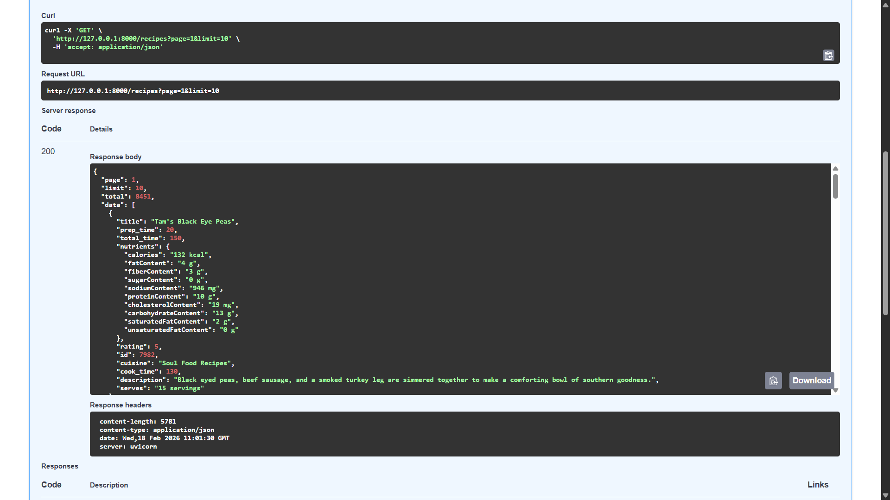
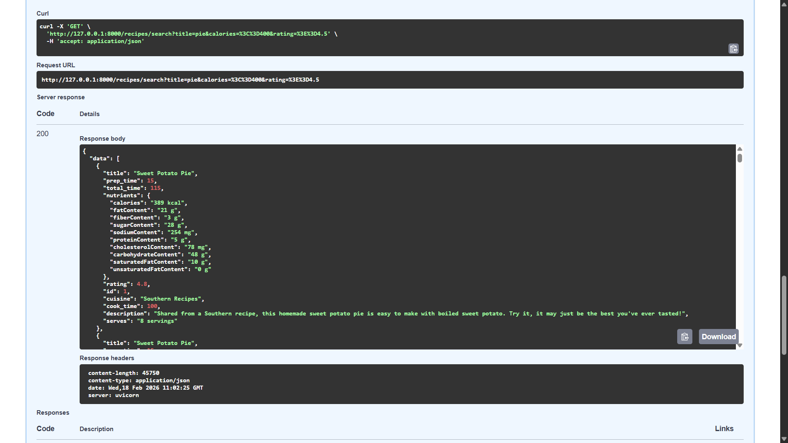

# Recipe Management System API

A high-performance RESTful API built with FastAPI and SQLAlchemy for
managing and searching a database of over 8,000 recipes. This project
demonstrates advanced backend engineering concepts, specifically
focusing on dynamic query filtering, resource lifecycle management, and
application-level data processing.

------------------------------------------------------------------------

## Tech Stack

-   **Framework:** FastAPI (High performance, asynchronous support,
    auto-generated Swagger UI)
-   **ORM:** SQLAlchemy (Declarative mapping for efficient database
    interactions)
-   **Database:** MySQL (Reliable relational data storage)
-   **Runtime:** Python 3.x
-   **Web Server:** Uvicorn (Lightning-fast ASGI server)

------------------------------------------------------------------------

## Project Structure

-   **main.py** -- Application entry point containing API routes and the
    dynamic filtering engine.
-   **database.py** -- Handles the SQLAlchemy engine configuration and
    the database session dependency.
-   **tables.py** -- Defines the database schema using the SQLAlchemy
    Declarative Base.
-   **load_data.py** -- Robust ingestion script that sanitizes raw JSON
    data (handling NaN values) for database migration.

------------------------------------------------------------------------

## Setup and Installation

### 1. Clone the Repository

    git clone https://github.com/rajtharun08/recipe-api.git
    cd recipe-api

### 2. Install Dependencies

    pip install fastapi sqlalchemy uvicorn pymysql

### 3. Configure Database

Update the connection URL in `database.py` with your MySQL credentials.

**Note:** If your password contains special characters like `@`, ensure
they are URL-encoded (e.g., `@` becomes `%40`).

### 4. Ingest Data

Initialize the database and load the initial recipe dataset:

    python load_data.py

### 5. Run the Server

    uvicorn main:app --reload

------------------------------------------------------------------------

## API Endpoints & Testing

### 1. Paginated Recipe List

Returns a structured list of recipes with metadata, allowing the
frontend to handle large datasets efficiently.

**URL:**

    GET /api/recipes

**Query Params:**

-   `page` -- Requested page number (default: 1)
-   `limit` -- Number of records per page (default: 10)

**Response Structure:**

    {
      "page": 1,
      "limit": 10,
      "total": 8213,
      "data": [...]
    }

------------------------------------------------------------------------

### 2. Advanced Search

Provides a powerful search engine supporting partial text matches and
mathematical comparisons.

**URL:**

    GET /api/recipes/search

        

**Supported Filters:**

-   `title` -- Partial title match (e.g., pasta)
-   `cuisine` -- Exact cuisine filter
-   `rating` -- Numeric comparison (e.g., \>=4.5)
-   `total_time` -- Duration comparison (e.g., \<=30)
-   `calories` -- Numeric comparison on complex nutrient data (e.g.,
    \<=500)

**Example Request:**

    GET /api/recipes/search?title=pie&calories=<=400&rating=>=4.5

  

------------------------------------------------------------------------

## Highlights

### Dynamic SQL Mapping

Implemented a `comparison_helper` that utilizes Python's `getattr()` to
map URL symbols (`>=`, `<=`, `>`, `<`) directly to SQLAlchemy methods.
This design follows the DRY (Don't Repeat Yourself) principle and keeps
the codebase clean and extensible.

### Application-Level Data Processing

Filtering by calories presented a challenge since they are stored within
a text-based JSON column. An Application-Level Filtering layer extracts
numeric values from strings in Python memory, enabling accurate
mathematical comparisons that standard SQL cannot perform on
unstructured text.

### Resource Lifecycle Management

The database connection is managed via a FastAPI dependency provider
using the `yield` keyword. This ensures every request receives a unique
session that is strictly closed in a `finally` block, preventing
connection leaks and optimizing performance in development environments.
